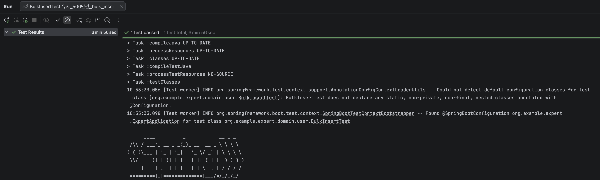
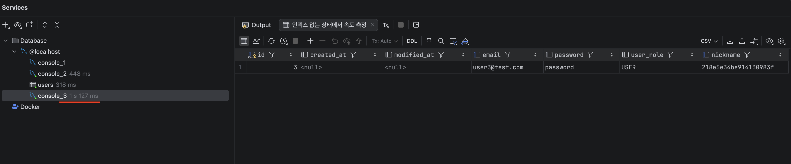
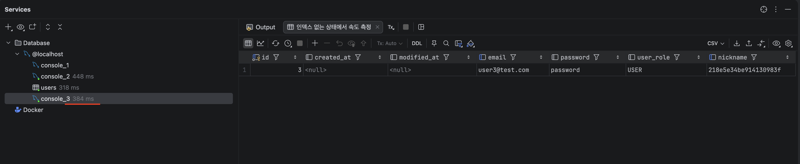

# SPRING PLUS

## 구현 내용

---

## 1. Spring Security 적용

기존 `Filter` + `ArgumentResolver` 방식을 Spring Security로 전환했습니다.

### 변경 전
- `JwtFilter` (Jakarta Servlet `Filter`) → `request.setAttribute()`로 유저 정보 저장
- `AuthUserArgumentResolver` → `request.getAttribute()`로 유저 정보 꺼냄
- `FilterConfig`에 수동 등록

### 변경 후
- `JwtSecurityFilter` (`OncePerRequestFilter`) → `SecurityContextHolder`에 `Authentication` 저장
- `AuthUserArgumentResolver` → `SecurityContextHolder`에서 유저 정보 꺼냄
- `SecurityConfig`에서 경로별 접근 권한 설정

### SecurityConfig 설정
| 경로 | 권한 |
|---|---|
| `/auth/**` | 누구나 접근 가능 |
| `/admin/**` | ADMIN 권한만 가능 |
| 나머지 | 인증된 사용자만 가능 |

---

## 2. QueryDSL 일정 검색 API

### API
`GET /todos/search`

### 검색 조건 (모두 선택사항)
| 파라미터 | 설명 |
|---|---|
| `keyword` | 일정 제목 키워드 (부분 일치) |
| `nickname` | 담당자 닉네임 (부분 일치) |
| `startDate` | 생성일 시작 범위 |
| `endDate` | 생성일 종료 범위 |
| `page` | 페이지 번호 (기본값: 1) |
| `size` | 페이지 크기 (기본값: 10) |

### 반환값
- 일정 제목
- 담당자 수
- 댓글 수
- 생성일 / 수정일

### 쿼리 전략
- `BooleanBuilder`로 동적 조건 처리
- `Projections.constructor()`로 필요한 필드만 DTO로 바로 매핑
- `COUNT(DISTINCT)`로 JOIN 중복 제거
- 생성일 최신순 정렬 + 페이징 처리

---

## 3. 트랜잭션 심화 - 매니저 등록 로그

매니저 등록 요청 시 결과(성공/실패)를 `log` 테이블에 항상 기록합니다.

### 핵심
매니저 등록이 실패해도 로그는 반드시 저장되어야 합니다.

### 해결 방법
`LogService`에 `@Transactional(propagation = Propagation.REQUIRES_NEW)` 적용

[매니저 등록 트랜잭션]

├── 성공 → 로그 "SUCCESS" 저장 (별도 트랜잭션) ✅

└── 실패 → 로그 "FAIL" 저장 (별도 트랜잭션) ✅ → 매니저 등록 롤백 ❌


### 로그 테이블 (log)
| 컬럼 | 설명 |
|---|---|
| `todoId` | 대상 일정 ID |
| `requestUserId` | 요청한 유저 ID |
| `managerUserId` | 등록하려 한 담당자 ID |
| `result` | SUCCESS / FAIL |
| `createdAt` | 요청 시각 |

---

## 4. 대용량 데이터 처리

### 유저 500만 건 생성
JDBC `PreparedStatement`의 `addBatch()` / `executeBatch()`를 활용한 Bulk Insert

- 1000건씩 묶어서 한 번에 INSERT
- UUID로 닉네임 랜덤 생성 (중복 방지)
- 소요 시간: 약 **3분 56초**
  

### 닉네임 검색 API
`GET /users/search?nickname={nickname}` (정확히 일치)

### 성능 개선 결과

| 방법 | 조회 속도 |
|---|---|
| 인덱스 없음 (풀 스캔) | 1.127초 |
| 단순 인덱스 (`nickname`) | 0.384초 |

인덱스 적용으로 약 **3배** 성능 향상

### 인덱스 적용
```sql
CREATE INDEX idx_users_nickname ON users(nickname);
```

인덱스 생성 전


인덱스 생성 후



